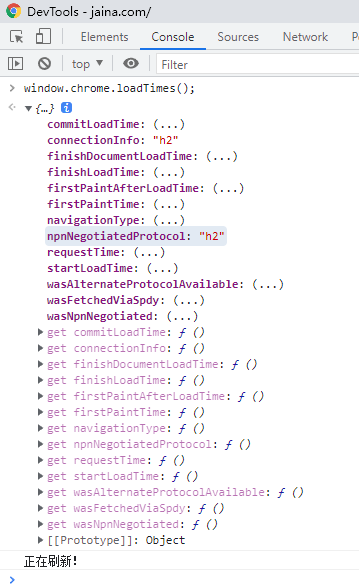

###SSL证书配置
####目录结构
```shell
.  
├── ca.crt  
├── ca.key  
├── http.ext  
├── server.crt  
├── server.csr  
└── server.key  
```
####证书信息
ca.crt: ca证书，客户端信任该证书意味着会信任该证书颁发出去的所有证书  
ca.key: ca证书的密钥  
server.key: 服务器密钥，需要配置的  
server.csr: 证书签名请求,通常是交给CA机构，这里我们就自己解决了  
server.crt: 服务器证书，需要配置的  
####证书生成
```shell
创建 CA 私钥:
openssl genrsa -des3 -out ca.key 4096

生成 CA 的自签名证书，其实 CA 证书就是一个自签名证书
openssl req -new -x509 -days 365 -key ca.key -out ca.crt

生成需要颁发证书的私钥
openssl genrsa -des3 -out server.key 4096

生成要颁发证书的证书签名请求
(证书签名请求当中的 Common Name 必须区别于 CA 的证书里面的 Common Name)
openssl req -new -key server.key -out server.csr

创建http.ext文件，内容如下
keyUsage = nonRepudiation, digitalSignature, keyEncipherment
extendedKeyUsage = serverAuth, clientAuth
subjectAltName=@SubjectAlternativeName

[ SubjectAlternativeName ]
DNS.1=jaina.com
DNS.2=*.jaina.com

用CA证书(ca.crt)给将要颁发证书的**签名请求**(server.key)进行签名
openssl x509 -req -days 365 -extfile http.ext -in server.csr -CA ca.crt -CAkey ca.key -set_serial 01 -out server.crt
```
####证书使用
_apache配置_
```shell
启用SSL
a2enmod ssl
a2ensite default-ssl
```
_存放位置_
```shell
root@ubuntu:~/ssl# tree /etc/apache2/ssl/
/etc/apache2/ssl/
├── ca.crt
├── server.crt
└── server.key
```
_配置文件_
```shell
/etc/apache2/sites-available/default-ssl.conf

<IfModule mod_ssl.c>
        <VirtualHost _default_:443>
                ServerAdmin webmaster@localhost
                ServerName https://192.168.157.128:443
                ……
                SSLEngine on
                SSLCertificateFile      /etc/apache2/ssl/server.crt
                SSLCertificateKeyFile   /etc/apache2/ssl/server.key
                #SSLCertificateChainFile /etc/apache2/ssl/ca.crt
```
```shell
/etc/apache2/ports.conf

# If you just change the port or add more ports here, you will likely also
# have to change the VirtualHost statement in
# /etc/apache2/sites-enabled/000-default.conf

Listen 80

<IfModule ssl_module>
        Listen 443
</IfModule>

<IfModule mod_gnutls.c>
        Listen 443
</IfModule>

# vim: syntax=apache ts=4 sw=4 sts=4 sr noet
```

###HTTP2配置
**验证**  
`connectionInfo` 和 `npnNegotiatedProtocol` 是h2就说明使用的是http2
  
**验证1**  
_带ca证书验证，http2的前提是https_
```shell
root@ubuntu:/opt# curl -vL --cacert /mnt/hgfs/bysj-for-wxk/SSL\ and\ HTTP2/ca.crt https://jaina.com
*   Trying 192.168.157.128:443...
* TCP_NODELAY set
* Connected to jaina.com (192.168.157.128) port 443 (#0)
* ALPN, offering h2
* ALPN, offering http/1.1
* successfully set certificate verify locations:
*   CAfile: /mnt/hgfs/bysj-for-wxk/SSL and HTTP2/ca.crt
  CApath: /etc/ssl/certs
* TLSv1.3 (OUT), TLS handshake, Client hello (1):
* TLSv1.3 (IN), TLS handshake, Server hello (2):
* TLSv1.3 (IN), TLS handshake, Encrypted Extensions (8):
* TLSv1.3 (IN), TLS handshake, Certificate (11):
* TLSv1.3 (IN), TLS handshake, CERT verify (15):
* TLSv1.3 (IN), TLS handshake, Finished (20):
* TLSv1.3 (OUT), TLS change cipher, Change cipher spec (1):
* TLSv1.3 (OUT), TLS handshake, Finished (20):
* SSL connection using TLSv1.3 / TLS_AES_256_GCM_SHA384
* ALPN, server accepted to use h2
* Server certificate:
*  subject: C=CN; ST=ZJ; L=HZ; O=HTZY; OU=HTZY-YW; CN=jaina.com; emailAddress=1218304973@qq.com
*  start date: Jan  5 03:16:14 2022 GMT
*  expire date: Jan  5 03:16:14 2023 GMT
*  subjectAltName: host "jaina.com" matched cert's "jaina.com"
*  issuer: C=CN; ST=ZJ; L=HZ; O=HTZY; OU=HTZY-YW; CN=WuXiaoKang; emailAddress=1218304973@qq.com
*  SSL certificate verify ok.
* Using HTTP2, server supports multi-use
* Connection state changed (HTTP/2 confirmed)
* Copying HTTP/2 data in stream buffer to connection buffer after upgrade: len=0
* Using Stream ID: 1 (easy handle 0x55667db31e10)
> GET / HTTP/2
> Host: jaina.com
> user-agent: curl/7.68.0
> accept: */*
>
* TLSv1.3 (IN), TLS handshake, Newsession Ticket (4):
* TLSv1.3 (IN), TLS handshake, Newsession Ticket (4):
* old SSL session ID is stale, removing
* Connection state changed (MAX_CONCURRENT_STREAMS == 100)!
< HTTP/2 200
< date: Wed, 05 Jan 2022 08:43:18 GMT
< server: Apache/2.4.41 (Ubuntu)
< last-modified: Tue, 04 Jan 2022 09:14:00 GMT
< etag: "5fad-5d4be0ec1a600"
< accept-ranges: bytes
< content-length: 24493
< vary: Accept-Encoding
< content-type: text/html
```
**问题**  
```shell
apache2错误日志

The mpm module (prefork.c) is not supported by mod_http2. The mpm determines how things are processed in your server. HTTP/2 has more demands in this regard and the cu
rrently selected mpm will just not do. This is an advisory warning. Your server will continue to work, but the HTTP/2 protocol will be inactive.
```
mpm_prefork模式和apache的php扩展、http2扩展不能共存

**配置**  
将apache切换到mpm_event模式,将php切换到fpm模式
```shell
apt-get install php7.4-fpm
 
禁用cli模式、启用fpm模式
a2dismod php7.4
a2enconf php7.4-fpm
a2enmod proxy_fcgi

prefork模式、启用event模式、启用http2
a2dismod mpm_prefork
a2enmod mpm_event
a2enmod http2

systemctl restart apache2
```
**配置文件** 
```shell
/etc/apache2/sites-available/default-ssl.conf

<IfModule mod_ssl.c>
        <VirtualHost _default_:443>
                ServerAdmin webmaster@localhost
                ServerName https://192.168.157.128:443
                Protocols h2 http/1.1   
                ……     
```
```shell
/etc/apache2/mods-available/http2.load

LoadModule http2_module /usr/lib/apache2/modules/mod_http2.so
<IfModule http2_module>
    LogLevel http2:info
</IfModule>      
```